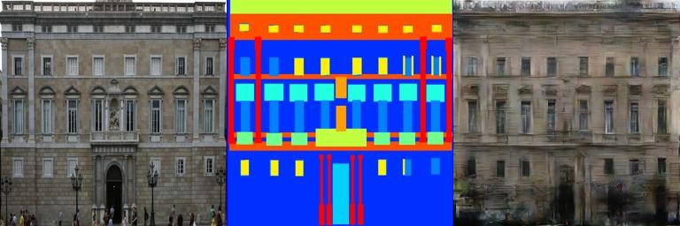

# pix2pix

Reimplementation of [Image-to-Image Translation Using Conditional Adversarial Networks](https://arxiv.org/pdf/1611.07004v1.pdf) with PyTorch.

Code heavily borrowed from [DCGAN example of official pytorch repo](https://github.com/pytorch/examples/blob/master/dcgan/main.py).

## Setup

### Prerequisites

+ Python
+ Numpy, Scipy and scikit-image
+ pytorch

### Getting Started

```sh
# download the CMP Facades dataset from https://people.eecs.berkeley.edu/~tinghuiz/projects/pix2pix/datasets/

# decompress it to some folder /path/to/facades

# train
python pix2pix.py \
  --train_dir /path/to/facades/train \
  --train_dir /path/to/facades/test \
  --max_epochs 200 \

# test
python export.py \
  --model checkpoint/netG_epoch_rl_200.pth
  --image_dir /path/to/facades/test \
```

### Results



Left: ground-truth. Middle: facades. Right: generated image.
